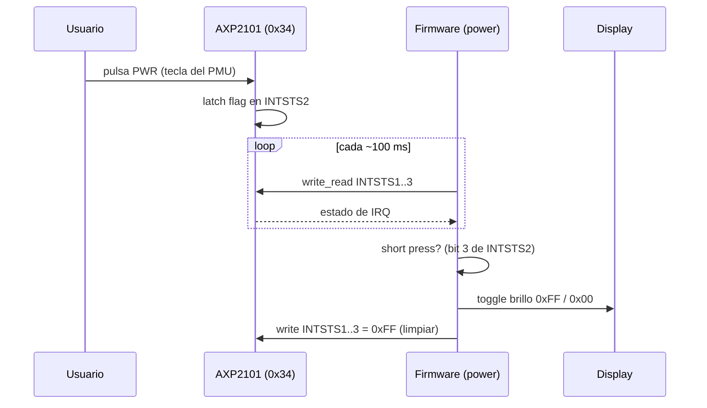

# Botones: BOOT y PWR

La placa tiene **dos botones laterales** y son fundamentalmente distintos:

| Botón | Conexión        | Cómo se lee               | Módulo   |
| ----- | --------------- | ------------------------- | -------- |
| BOOT  | GPIO0 directo   | GPIO con pull-up          | `main`   |
| PWR   | Tecla del PMU   | Registros IRQ por I2C     | `power`  |

## BOOT button (GPIO0)

Un botón normal cableado a **GPIO0** con pull-up. En reposo lee alto; al
pulsar cae a bajo. El firmware lo usa con `wait_for_falling_edge()` /
`wait_for_rising_edge()`.

> También sirve para entrar en modo descarga (BOOT + RESET) al flashear.

## PWR button (vía AXP2101) — ⚠️ NO es un GPIO

**Este es el punto que hay que recordar:** el botón PWR **no** llega a ningún
GPIO del ESP32. Está cableado a la **tecla de encendido (PWRON) del chip de
gestión de energía AXP2101**, que vive en el bus I2C (`0x34`). El PMU registra
los eventos de la tecla en sus registros de interrupción, y el firmware los
**sondea por I2C** (no hay línea IRQ del PMU cableada a un GPIO conocido).

Esto lo confirmé en:

- Wiki de Waveshare: el demo `05_LVGL_AXP2101` "provides PWR custom button
  control for screen on and off actions".
- El ejemplo ESP-IDF `01_AXP2101` y `XPowersLib`.

### Registros relevantes del AXP2101

| Registro | Dirección | Descripción                      |
| -------- | --------- | -------------------------------- |
| IC_TYPE  | `0x03`    | Chip ID; debe leer `0x4A`        |
| INTEN1   | `0x40`    | Habilitación de IRQ (banco 1)    |
| INTEN2   | `0x41`    | Habilitación de IRQ (banco 2)    |
| INTEN3   | `0x42`    | Habilitación de IRQ (banco 3)    |
| INTSTS1  | `0x48`    | Estado de IRQ (banco 1)          |
| INTSTS2  | `0x49`    | Estado de IRQ (banco 2)          |
| INTSTS3  | `0x4A`    | Estado de IRQ (banco 3)          |

Flags de la tecla de encendido (en **INTSTS2**, tras `>> 8`):

| Evento            | Bit en INTSTS2 | Máscara |
| ----------------- | -------------- | ------- |
| PWRON short press | bit 3          | `0x08`  |
| PWRON long press  | bit 2          | `0x04`  |

(En el enum de 32 bits de XPowersLib: `PKEY_SHORT = _BV(11)`,
`PKEY_LONG = _BV(10)`; al quedar en el segundo byte se desplazan `>> 8`.)

### Secuencia del firmware

1. `init()`: leer IC_TYPE (`0x03`) y comprobar `0x4A`. Habilitar en INTEN2 los
   bits short+long press. Limpiar todos los flags (escribir `0xFF` en INTSTS1..3).
2. Sondeo periódico (cada ~100 ms): leer INTSTS1..3, mirar INTSTS2.
   - short press → alterna el brillo del display (`0xFF` ↔ `0x00`).
   - long press → solo se registra en log.
3. Tras detectar un evento, limpiar los flags (`0xFF`).

Ver [`src/power.rs`](../src/power.rs).

### ⚠️ Advertencias

- El sondeo tiene una latencia máxima de ~100 ms (imperceptible para un botón).
- El AXP2101 puede tener habilitado por hardware el **apagado por long-press**
  (config de fábrica). Si mantienes pulsado, la placa podría apagarse: eso es
  comportamiento del PMU, no del firmware.
- "Apagar la pantalla" = brillo `0x00` (el panel sigue alimentado). No corta
  energía.
- Si el PMU no responde en `0x34`, `Axp2101::init` devuelve `None` y el PWR
  simplemente no hace nada; el resto del firmware sigue funcionando.
