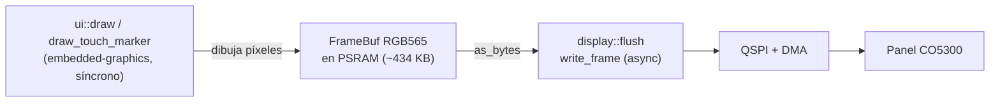

# Display AMOLED CO5300

Panel AMOLED de **466×466 px, 16.7M colores**, con driver **CO5300** conectado
por **QSPI**. Verificado funcionando en hardware.

## Parámetros

| Parámetro          | Valor                            |
| ------------------ | -------------------------------- |
| Resolución         | 466 × 466                        |
| Formato de color   | RGB565 (2 bytes/px)              |
| Tamaño framebuffer | 466 × 466 × 2 ≈ 434 KB           |
| Ubicación FB       | PSRAM (no cabe en SRAM interna)  |
| Reloj QSPI         | 40 MHz                           |
| Buffer DMA         | 8192 bytes (tope por chunk QSPI) |

## Pines

Ver [`pinout.md`](pinout.md). SCLK=GPIO38, CS=GPIO12, D0..D3=GPIO4/5/6/7,
RESET=GPIO39. Periféricos: `SPI2`, `DMA_CH0`, `PSRAM`.

## Protocolo QSPI

El wrapper `QspiFlashBus` de `display-driver` convierte cada comando lógico en
un header de 4 bytes `[opcode, addr_hi, addr_mid, addr_lo]`:

- `opcode = 0x02` → escritura de registros.
- `opcode = 0x32` → escritura de píxeles (RAM).

Sobre el QSPI del ESP32: comando + dirección de 24 bits viajan por **una línea**,
los datos de píxeles por **las cuatro líneas** (`DataMode::Quad`). Para streamear
frames grandes se continúa el WRITE_RAM con opcode `0x32` y dirección
`0x00_3C_00` (CONTINUE_WRITE_RAM) en los chunks siguientes.

Ver [`src/display/qspi_bus.rs`](../src/display/qspi_bus.rs).

## Flujo de render

`embedded-graphics` es síncrono, así que se dibuja en un `FrameBuf` (en PSRAM)
y luego se empuja el frame completo por QSPI de forma asíncrona:

## Brillo y encendido/apagado

`display.set_brightness(0x00..=0xFF)` controla el brillo del AMOLED. El firmware
lo usa para "apagar" (`0x00`) y "encender" (`0xFF`) la pantalla al pulsar el
botón PWR, sin cortar la alimentación del panel. Ver [`buttons.md`](buttons.md).

## Módulos relacionados

- [`src/display/mod.rs`](../src/display/mod.rs) — bring-up (`init`), `flush`.
- [`src/display/qspi_bus.rs`](../src/display/qspi_bus.rs) — bus QSPI.
- [`src/display/framebuffer.rs`](../src/display/framebuffer.rs) — `FrameBuf` PSRAM.
- [`src/board.rs`](../src/board.rs) — constantes de geometría y reloj.
