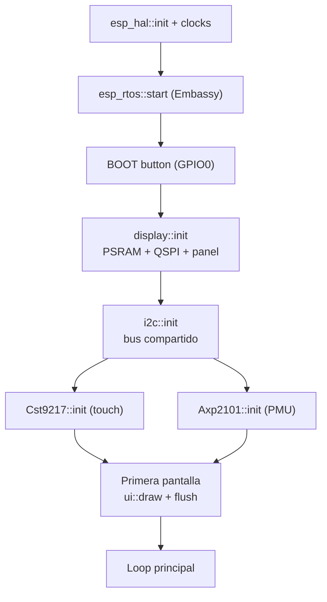
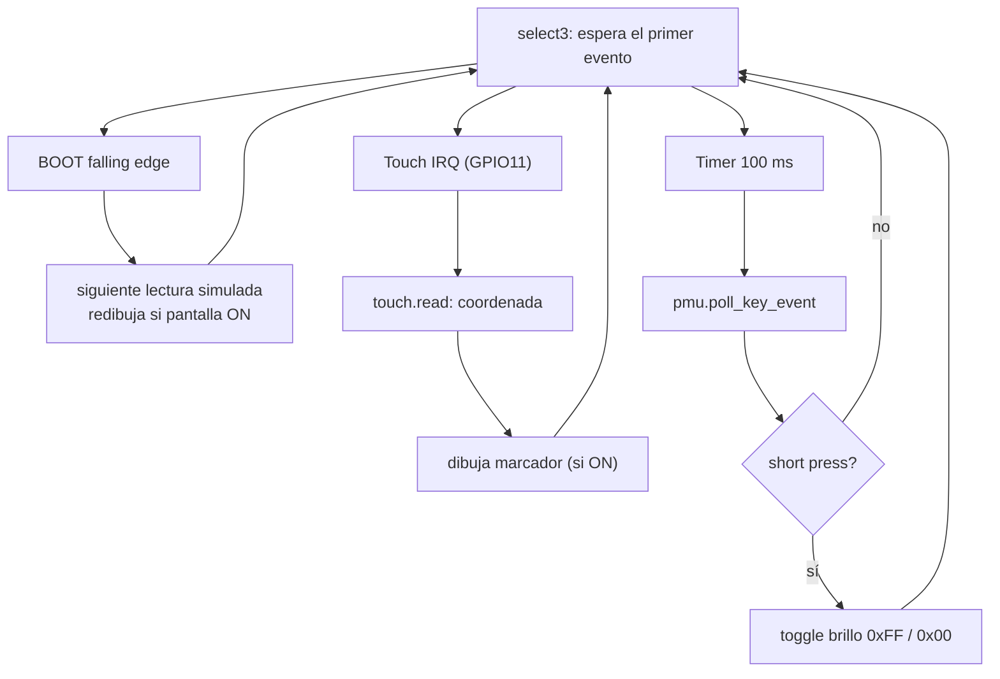

# Mapa firmware ↔ hardware

Cómo se organiza el código del crate `energy-meter` y qué hardware cubre cada
módulo.

## Estructura de módulos

```
src/
├── lib.rs              Declara los módulos públicos.
├── board.rs            Constantes: geometría del panel, relojes, direcciones I2C.
├── i2c.rs              Bus I2C compartido (Mutex embassy-sync + I2cDevice).
├── power.rs            PMU AXP2101: detección del botón PWR.
├── touch.rs            Touch CST9217: lectura de coordenadas.
├── ui.rs               Render con embedded-graphics (draw, draw_touch_marker).
├── display/
│   ├── mod.rs          Bring-up del CO5300 (init, flush) + tipos.
│   ├── qspi_bus.rs     DisplayBus sobre QSPI del ESP32.
│   └── framebuffer.rs  FrameBuf RGB565 en PSRAM (impl DrawTarget).
└── bin/
    └── main.rs         Orquestador: inicializa todo y corre el loop principal.
```

## Tabla módulo → hardware

| Módulo               | Hardware                        | Periféricos / pines                          |
| -------------------- | ------------------------------- | -------------------------------------------- |
| `display`            | AMOLED CO5300                   | SPI2, DMA_CH0, PSRAM, GPIO38/12/4/5/6/7/39   |
| `i2c`                | Bus I2C compartido              | I2C0, GPIO15 (SDA), GPIO14 (SCL)             |
| `touch`              | Touch CST9217 (`0x5A`)          | bus I2C + GPIO11 (INT), GPIO40 (RESET)       |
| `power`              | PMU AXP2101 (`0x34`)            | bus I2C                                      |
| `ui`                 | — (dibuja en el framebuffer)    | —                                            |
| `main`               | Botón BOOT + orquestación       | GPIO0                                        |

## Flujo de `main`

1. Inicializa clocks, timers y el runtime de Embassy (`esp_rtos`).
2. Configura el botón BOOT (GPIO0).
3. `display::init(...)` → PSRAM, QSPI, panel; devuelve `(Display, FrameBuf)`.
4. `i2c::init(...)` → bus compartido.
5. `Cst9217::init(i2c::device(bus), ...)` → touch.
6. `Axp2101::init(i2c::device(bus))` → PMU (o `None` si no responde).
7. Dibuja la primera pantalla.
8. Loop con `select3` (ver abajo).

### Arranque



### Loop principal (`select3`)



## Convenciones

- **Structs de periféricos** (`DisplayPeripherals`, `TouchPeripherals`,
  `I2cPeripherals`): agrupan los pines/periféricos que consume cada subsistema,
  documentando la propiedad y manteniendo firmas legibles.
- **`no_std` sin alloc**: el formateo de texto (`ui::format_watts`) evita heap.
- **Async**: todo el I/O es asíncrono (esp-hal `Async`, embassy).
- Validación: `cargo build` (target `xtensa-esp32s3-none-elf`, toolchain `esp`).
  No hay hardware para el agente; las pruebas en placa las hace el usuario.

## Al añadir un periférico nuevo

1. Revisa [`pinout.md`](pinout.md) para no colisionar con GPIOs ocupados.
2. Si es I2C, crea un handle con `i2c::device(bus)` (no abras otro `I2C0`).
3. Crea un módulo con su `struct XxxPeripherals` y su driver.
4. Regístralo en `lib.rs` y cablea la inicialización en `main.rs`.
5. Documenta la conexión aquí y en el doc correspondiente.
