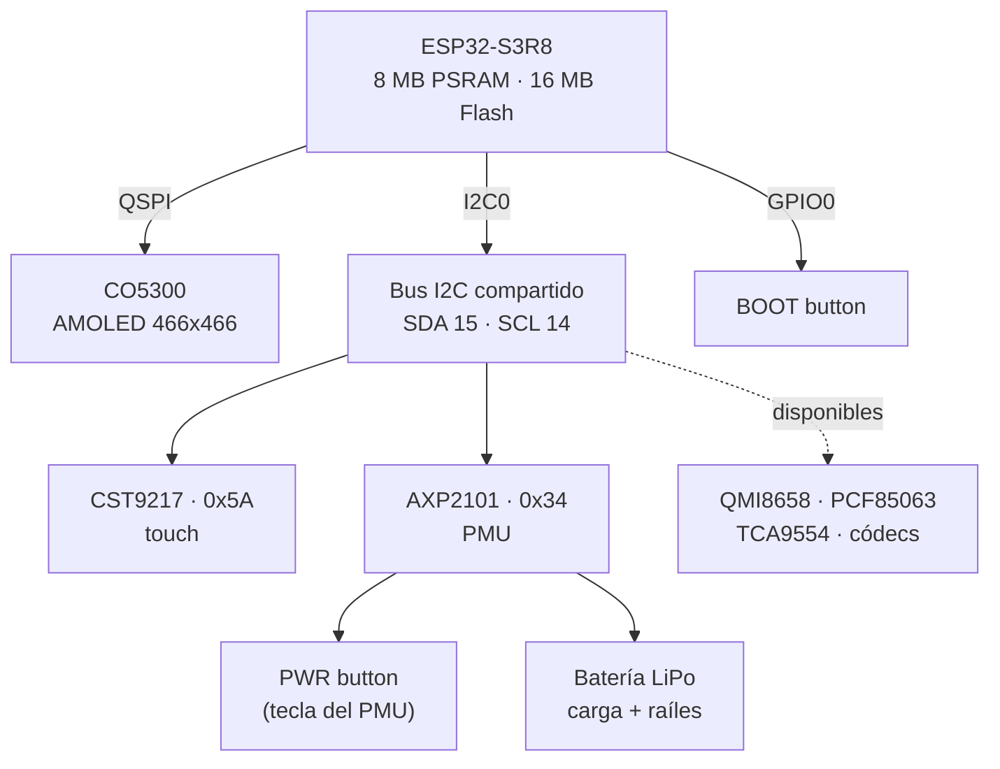

# Hardware — Waveshare ESP32-S3-Touch-AMOLED-1.75

Placa de desarrollo compacta basada en ESP32-S3 con AMOLED táctil, gestión de
energía, IMU, RTC, audio y almacenamiento.

## MCU

| Parámetro       | Valor                                             |
| --------------- | ------------------------------------------------- |
| SoC             | ESP32-S3R8 (Xtensa LX7 dual-core, hasta 240 MHz)  |
| SRAM interna    | 512 KB                                            |
| PSRAM           | 8 MB (octal, usada para el framebuffer del panel) |
| Flash           | 16 MB                                             |
| Radios          | Wi-Fi 2.4 GHz 802.11 b/g/n, Bluetooth 5 (LE)      |
| Target Rust     | `xtensa-esp32s3-none-elf` (toolchain `esp`)       |

## Topología general

## Componentes integrados

| Componente | Función                    | Interfaz | Dirección I2C | Notas |
| ---------- | -------------------------- | -------- | ------------- | ----- |
| CO5300     | Driver AMOLED 466×466      | QSPI     | —             | Ver [`display.md`](display.md) |
| CST9217    | Touch capacitivo (2 puntos)| I2C      | `0x5A`        | Ver [`i2c-bus.md`](i2c-bus.md) |
| AXP2101    | Power Management IC (PMU)  | I2C      | `0x34`        | El botón PWR va aquí, no a un GPIO |
| QMI8658    | IMU 6 ejes (acel + giro)   | I2C      | —             | No usado por el firmware (aún) |
| PCF85063   | RTC                        | I2C      | —             | No usado por el firmware (aún) |
| ES8311     | Códec de audio             | I2C/I2S  | —             | No usado por el firmware (aún) |
| ES7210     | Cancelación de eco         | I2C/I2S  | —             | No usado por el firmware (aún) |
| TCA9554    | Expansor de IO             | I2C      | —             | No usado por el firmware (aún) |
| microSD    | Almacenamiento             | SDMMC/SPI| —             | No usado por el firmware (aún) |

## Alimentación

El **AXP2101** gestiona toda la energía de la placa: carga de batería LiPo
(conector MX1.25), múltiples raíles de voltaje y el botón de encendido. Es un
detalle crítico para el firmware porque **el botón PWR está cableado a la tecla
de encendido del PMU**, no a un GPIO del ESP32 (ver [`buttons.md`](buttons.md)).

## Estado del firmware

Periféricos ya integrados:

- ✅ AMOLED CO5300 (QSPI + framebuffer PSRAM + embedded-graphics)
- ✅ Touch CST9217 (I2C)
- ✅ Botón PWR vía PMU AXP2101 (I2C) — enciende/apaga la pantalla
- ✅ Botón BOOT (GPIO0)

Pendientes / no cableados en firmware: IMU, RTC, audio, SD, expansor IO, GNSS.
