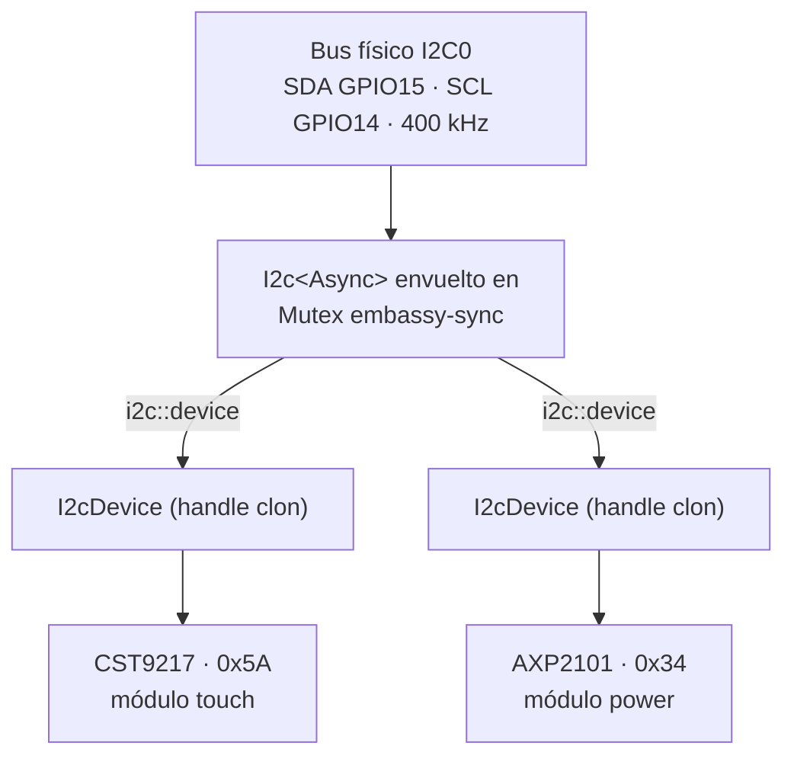
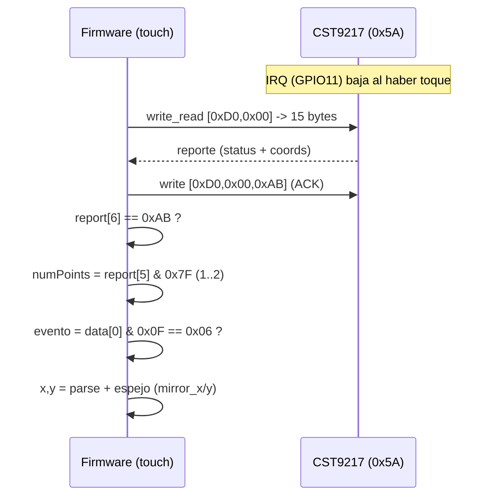

# Bus I2C compartido

El touch capacitivo (**CST9217**) y el chip de gestión de energía (**AXP2101**)
cuelgan del **mismo bus I2C físico**:

- SDA = **GPIO15**
- SCL = **GPIO14**
- Frecuencia = **400 kHz**
- Periférico esp-hal = `I2C0`

Como dos drivers necesitan el mismo bus, el firmware lo envuelve en un
`Mutex` de `embassy-sync` y reparte handles cloneables (`I2cDevice` de
`embassy-embedded-hal`). Ver el módulo [`src/i2c.rs`](../src/i2c.rs).



## Dispositivos en el bus

| Dispositivo | Dirección | Módulo   | Estado firmware |
| ----------- | --------- | -------- | --------------- |
| CST9217     | `0x5A`    | `touch`  | ✅ usado        |
| AXP2101     | `0x34`    | `power`  | ✅ usado        |
| QMI8658     | —         | —        | disponible      |
| PCF85063    | —         | —        | disponible      |
| TCA9554     | —         | —        | disponible      |

Para añadir un dispositivo nuevo (p. ej. el IMU) basta con crear otro handle
con `i2c::device(bus)` y pasarlo a su driver; el mutex serializa los accesos.

---

## CST9217 — protocolo de lectura de toques

Derivado del driver oficial `TouchDrvCST92xx.cpp`. Registros big-endian de 16
bits.

Constantes:

- `READ_COMMAND = 0xD000`
- `ACK = 0xAB`
- `MAX_FINGERS = 2`
- Longitud del reporte = `MAX_FINGERS * 5 + 5 = 15` bytes

Secuencia `getPoint`:

1. `write_read`: escribir `[0xD0, 0x00]` y leer 15 bytes.
2. Escribir ACK: `[0xD0, 0x00, 0xAB]`.
3. Comprobar `report[6] == 0xAB` (device ACK); si no, no hay toque válido.
4. `numPoints = report[5] & 0x7F`; si es `0` o `> 2`, no hay toque.
5. Parsear cada dedo (el firmware usa solo el primero, `report[0..4]`):
   - `evento = data[0] & 0x0F` → válido solo si `== 0x06` (pressed).
   - `x = (data[1] << 4) | (data[3] >> 4)`
   - `y = (data[2] << 4) | (data[3] & 0x0F)`

Reset: RST bajo ≥10 ms, luego alto, esperar ~50 ms. IRQ activo bajo
(GPIO11 en bajo = hay reporte pendiente).



### Orientación / espejado

El panel está montado con **mirror en ambos ejes** (BSP oficial:
`mirror_x = 1, mirror_y = 1`). El firmware refleja las coordenadas crudas para
alinearlas con el espacio del display:

```
x = (LCD_WIDTH  - 1) - raw_x
y = (LCD_HEIGHT - 1) - raw_y
```

Verificado en hardware: con este espejado el punto tocado coincide con la
posición real en pantalla.

---

## AXP2101 — detección del botón PWR

El botón PWR está en la tecla de encendido (PWRON) del PMU. Se detecta leyendo
los registros de estado de interrupción por I2C. Ver [`buttons.md`](buttons.md)
para el detalle de registros y bits.
